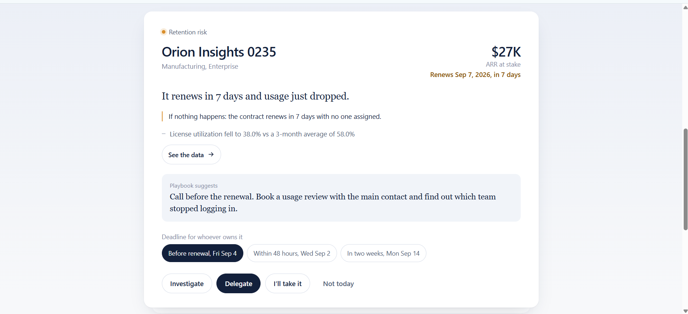
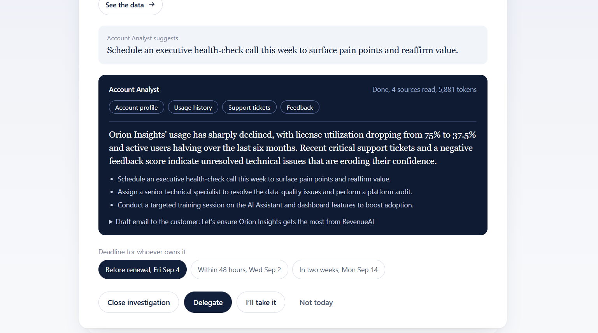
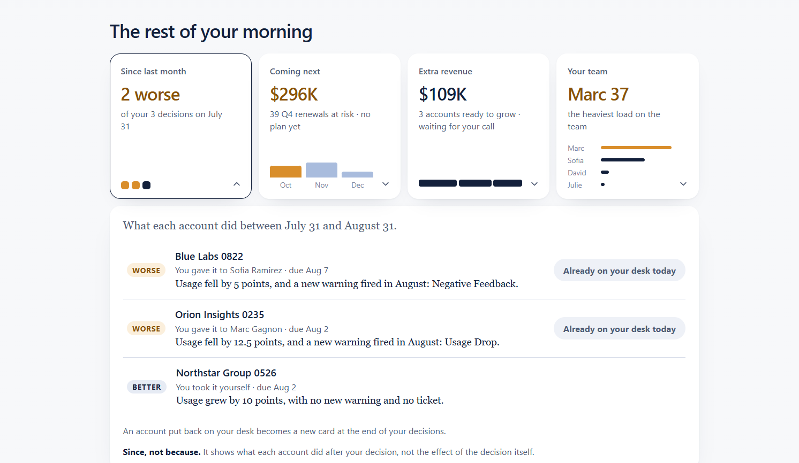
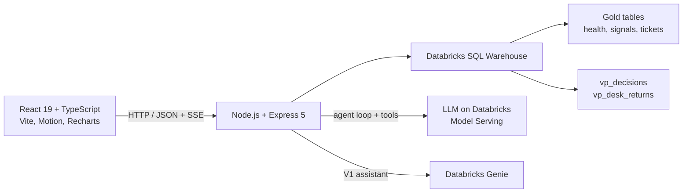
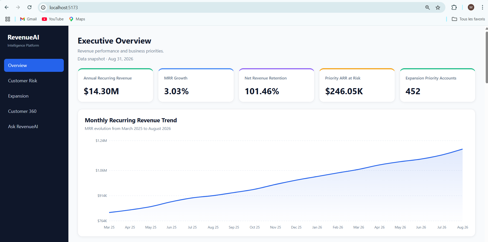
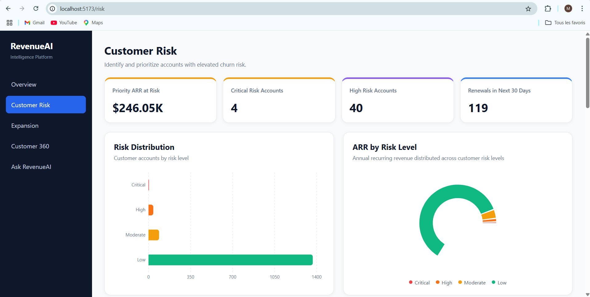
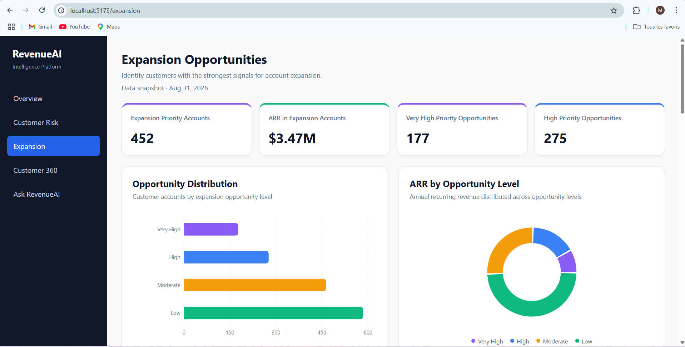
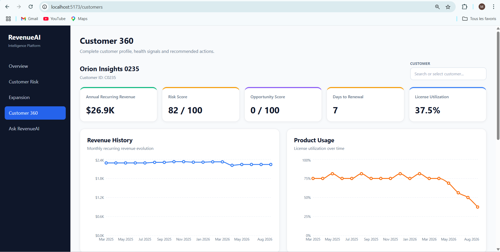
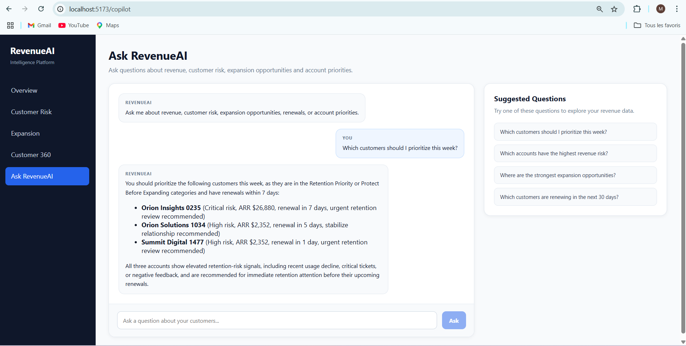

# SaaS Revenue Intelligence

**A Morning Brief for a VP of Revenue.** Every morning, AI agents read every customer account and put the few **decisions** that matter on the VP's desk (retention risks, renewals, growth opportunities) instead of a dashboard to explore.

The project has two versions, kept side by side on purpose:

| | V2: Morning Brief (`/brief`) | V1: Dashboard (`/`) |
|---|---|---|
| Question it answers | *What do I need to decide this morning?* | *What is happening in my revenue?* |
| Experience | A stack of decision cards, one at a time | Charts, tables and filters to explore |
| AI | Agents that investigate an account and explain what they saw | A conversational assistant (Databricks Genie) |

V1 is kept unchanged as the "before".

> The data is **synthetic** (a fictional SaaS company, 1,620 customers) and stops on **August 31, 2026**. The reference brief is August 2026.

---

## V2: The Morning Brief

### Screenshots







### How a morning works

1. **The agents prepare the brief.** Four agents each do one job:
   - **Signal Watcher** reads every account and finds the ones that changed this month (usage drop, support spike, negative feedback, downgrade, churn, expansion ready).
   - **Briefing Writer** keeps the decisions that need the VP, routes the rest to the team, and writes the brief.
   - **Trend Scout** finds next quarter's renewals that already show a warning sign.
   - **Follow-up Tracker** checks what happened to the accounts decided last month.
2. **The VP decides, one card at a time.** Each card says why the account is on the desk, what happens if nothing is done and how much ARR is at stake. The VP can delegate it to a team member with a deadline, take it, or set it aside for today (*Not today*). Every decision is saved, and it can be undone.
3. **The VP can dig deeper before deciding:**
   - **See the data**: the signals, usage, tickets and feedback behind the card.
   - **Investigate**: the *Account Analyst* agent investigates the account live, streams each source it reads, then returns a diagnosis and a plan.
   - **Ask the Account Analyst**: a conversation about this account, with suggested questions built from its data.
4. **Next month, the loop closes.** *Since last month* compares each decided account before and after: lost, shrank, worse, same or better. An account that got worse can be **put back on the desk**, and the server checks that it really did before accepting it.

### Principles built into the code

- **Agents observe; they do not prove causality.** The data contains no human action, so the brief says an account improved *since* a decision, never *because of* it.
- **A prompt is an instruction, not a guarantee.** Guardrails are enforced in code: the agent is locked to the account it investigates, and always reads at least 184 days of tickets and 6 months of usage.
- **The quarter goal gauge is never a probability.** It counts the ARR at risk on the desk that has **an owner and a deadline**.
- **Every sentence is generated from the data**, never written by hand for a specific account.
- **The brief shows its own track record**: of the 120 customers lost, 102 (85%) were flagged in the 3 months before, on average 2.3 months ahead. Known blind spot: contract reductions.
- Strict input validation on the server (201/204/400/409, IDs generated server-side), parameterized SQL only, and "reduce motion" respected.

### Performance

The SQL warehouse sleeps when idle, so the first query after a pause takes 17 to 27 s. The server **warms up** the warehouse and the follow-up cache as soon as it starts. Follow-ups are **cached per month** (about 2 s down to 0.01 s), and the cache is cleared whenever a decision changes.

---

## Architecture



- **Agents** share one engine (`server/src/agents/agentLoop.ts`). The model calls tools (`get_customer_profile`, `get_usage_history`, `get_support_tickets`, `get_feedback`) that run parameterized SQL, and each step is streamed to the browser with Server-Sent Events.
- **Decisions** are written to Databricks (`vp_decisions`), so the brief remembers what the VP decided and the next month can follow up.

| Folder | Stack |
|---|---|
| `client/` | React 19, Vite, TypeScript, Motion, Recharts, react-markdown |
| `server/` | Express 5, TypeScript (tsx), `@databricks/sql` |

### Main API routes (V2)

| Route | Purpose |
|---|---|
| `GET /api/brief?month=` | The morning brief: desk, team, info, goal |
| `GET/POST/DELETE /api/decisions` | The VP's decisions |
| `GET /api/followups?month=` | Last month's decisions vs what happened |
| `/api/returns` | "Put back on my desk" |
| `GET /api/agents/account-analyst/:id/stream` | Live investigation (SSE) |
| `GET /api/accounts/:id/evidence` · `POST /api/accounts/:id/ask` | Evidence drawer and conversation (SSE) |

---

## Run it locally

You need a Databricks workspace with the project schema, the Databricks CLI, and Node.js.

```bash
# 1. Sign in to Databricks (also the fix when the session expires)
databricks auth login --profile <your-profile>

# 2. Backend (port 3000)
cd server
npm install
npx tsx src/index.ts

# 3. Frontend (port 5173)
cd client
npm install
npm run dev
```

`server/.env` needs:

```
DATABRICKS_SERVER_HOSTNAME=...
DATABRICKS_HTTP_PATH=...
DATABRICKS_CONFIG_PROFILE=...
DATABRICKS_GENIE_AGENT_ID=...   # V1 assistant only
```

Then open `http://localhost:5173/brief`.

---

## V1: The Dashboard (the "before")

The first version is a classic Revenue Intelligence dashboard, kept as it was.

- **Executive Overview**: ARR, MRR growth, net revenue retention, ARR at risk, expansion accounts, revenue trends.
- **Customer Risk**: an explainable risk score built from customer signals, risk distribution, renewal urgency, priority account table.
- **Expansion Opportunities**: an expansion score, opportunity distribution, opportunities by plan.
- **Customer 360**: revenue, usage, support, feedback and a recommended next action for any active customer.
- **Ask RevenueAI**: a conversational assistant powered by Databricks Genie.

| Executive Overview | Customer Risk |
|---|---|
|  |  |
| **Expansion Opportunities** | **Customer 360** |
|  |  |



### Key business metrics (August 31, 2026)

| Metric | Value |
|---|---:|
| Active Customers | 1,500 |
| Annual Recurring Revenue | $14.30M |
| Monthly Recurring Revenue | $1.19M |
| MRR Growth | 3.03% |
| Net Revenue Retention | 101.46% |
| Priority ARR at Risk | $246.05K |
| Expansion Priority Accounts | 452 |
| ARR in Expansion Accounts | $3.47M |

The dataset contains **1,620 historical SaaS customers**, including 1,500 active accounts.

---

## What I learned

V1 answered "what is happening?" but left the VP to find what to do. V2 flips this: the agents do the reading, and the human makes the decisions. Building it taught me backend fundamentals (REST and SSE routes, input validation, parameterized SQL, caching and cache invalidation) and how to keep AI agents honest with guardrails enforced in code.
